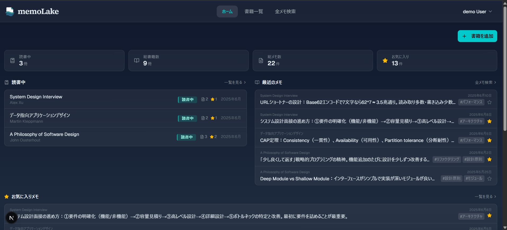
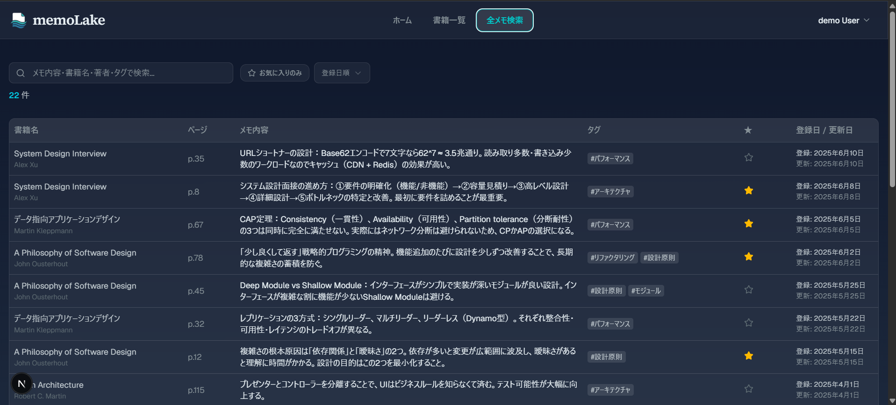
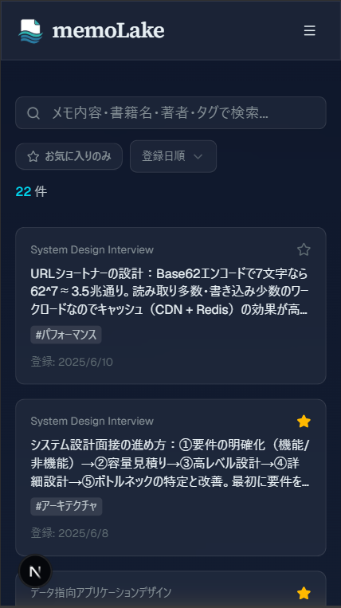

# memoLake — 読書メモ管理アプリ

読書中に思考・引用・感想を素早く記録し、後から検索・振り返りができる個人用読書記録アプリ。
SNS機能を持たず、「素早く記録すること」と「必要なメモをすぐ探せること」に特化しています。

## スクリーンショット

### ホーム（PC）


### 全メモ検索（PC）


### 全メモ検索（スマホ）


---

**デモ環境**：現在クローズドな検証段階のため新規登録（サインアップ）は無効化しています。動作確認は下記のデモアカウントをご利用ください。

---

## 主な設計・実装のポイント（技術評価者向けサマリ）

- **データ操作は Server Actions に集約**し、REST API レイヤを持たない。例外は OAuth コールバック（`/api/auth/callback`）のみ。
- **認可は DB の Row Level Security（RLS）で担保**。全テーブルで `user_id = auth.uid()` ベースのデータ分離を行い、`authenticated` ロールへの `GRANT` も明示的に付与している（RLS だけでは `permission denied` が発生するため）。
- **認証チェックの使い分け**：Proxy（`src/proxy.ts`）ではローカル JWT 検証（`getClaims()`）、Server Actions のミューテーション前ではサーバー問い合わせ（`getUser()`）を使用。`getSession()` はサーバーで使用しない。
- **`user_id` をクライアントから受け取らない**。全ミューテーション Action でセッション由来の値のみを使用。
- **バリデーションの二重防御**：クライアント側（react-hook-form + Zod）で UX のための即時検証、Server Action 側（Zod）で信頼境界の検証を行う。
- **pg_trgm + GIN インデックス**でタイトル・著者・メモ本文・タグ名の部分一致検索を高速化。
- **AI（Claude Fable 5）によるセキュリティレビュー・コードレビューを実施**し、検出された High/Medium 指摘をすべて修正済み（[詳細](#品質セキュリティチェック)）。
- **Next.js 16 の Proxy 規約**（`middleware.ts` から `proxy.ts` への改称）に準拠したルート保護を実装。
- **テストは単体（Vitest）・E2E／結合（Playwright）で構成**。Server Actions の単体テストと、画面横断の結合 E2E（INT-01〜INT-10）を実装。

---

## 機能

- 書籍の登録・編集・削除（タイトル・著者・ジャンル・読書ステータス・読了日）
- 読書メモの登録・編集・削除（ページ数・メモ内容・タグ・お気に入り）
- お気に入りメモの管理（楽観的UIによる即時トグル）
- 書籍・メモのキーワード検索、タグ絞り込み、お気に入り絞り込み
- メールアドレス / Google アカウント（OAuth）による認証
- アカウント管理（プロフィール更新・メールアドレス変更・パスワード変更・アカウント削除）
- レスポンシブデザイン（PC / スマートフォン対応）
- ホーム画面追加対応（Web App Manifest）

---

## 技術スタック

| 分類 | 技術 | バージョン |
|---|---|---|
| フレームワーク | Next.js（App Router） | 16.2.1 |
| UI | React | 19.2.4 |
| スタイル | Tailwind CSS | ^4 |
| コンポーネント | shadcn/ui（Radix UI ベース） | — |
| 言語 | TypeScript | ^5 |
| フォーム | react-hook-form | ^7.76.1 |
| バリデーション | Zod | ^4.4.3 |
| 認証 / DB | Supabase（`@supabase/ssr`） | ^0.10.3 |
| ホスティング | Vercel | — |
| 解析 | @vercel/analytics | ^2.0.1 |
| 単体テスト | Vitest | ^4.1.8 |
| E2E / 結合テスト | Playwright | ^1.60.0 |
| 静的解析 | Semgrep OSS | — |
| シークレットスキャン | Betterleaks | — |

### 技術選定の理由

| 技術 | 選定理由 |
|---|---|
| **Next.js（App Router）** | Server Actions により REST API レイヤを持たず、サーバー処理をフレームワーク内に完結させられる。Vercel との公式統合で main push による自動デプロイが容易。 |
| **Supabase** | Auth・PostgreSQL・RLS が一体のため、個人開発における認証基盤の実装コストを大幅に削減できる。`@supabase/ssr` が Next.js App Router の Cookie ベースセッション管理を公式サポート。 |
| **Server Actions** | Route Handler（`/api/*`）を排除してサーバー処理を一元化。`user_id` をクライアントから受け取らず常にセッションから取得する設計と相性がよい。 |
| **Row Level Security（RLS）** | アプリ層のバグがあっても他ユーザーのデータに到達しない多層防御を DB レベルで実現。ただし RLS だけでは `permission denied` が発生するため `GRANT` も明示的に付与している。 |
| **pg_trgm + GIN インデックス** | B-tree インデックスは `LIKE '%keyword%'` の部分一致に効かない。pg_trgm の GIN インデックスを使うことで、書籍タイトル・著者・メモ本文・タグ名の部分一致検索にインデックスを効かせられる。 |
| **Vitest + Playwright** | Vitest は Vite ベースで高速。Server Actions の単体テストに注力し、画面横断フローは Playwright E2E で担保することで、テスト対象を重複させず役割を分離した。 |

---

## アーキテクチャ

### データフロー

```
ブラウザ（Client Component）
  └─ Server Action 呼び出し
       ├─ getUser() で認証チェック（未認証なら UNAUTHORIZED）
       ├─ Zod でバリデーション
       └─ Supabase（PostgreSQL）
            └─ RLS で user_id ベースのアクセス制御
```

データ操作はすべて **Server Actions** に集約。REST API レイヤは持たない。唯一の API Route は OAuth コールバック（`/api/auth/callback`）で、認可コードのセッション交換とメールリンク（OTP）検証を担う。

### Supabase クライアントの分離

| 用途 | ファイル | 生成関数 |
|---|---|---|
| Client Component / ブラウザ | `lib/supabase/client.ts` | `createBrowserClient` |
| Server Component / Server Actions / Route Handler | `lib/supabase/server.ts` | `createServerClient` |
| Proxy（セッション更新・ルート保護の実処理） | `lib/supabase/proxy.ts` | `createServerClient` + `getClaims()` |

### 認証・認可の方針

- **Proxy（`src/proxy.ts`）**：Next.js 16 で `middleware.ts` から改称された Proxy 規約を使用。`lib/supabase/proxy.ts` の `updateSession()` を呼び出し、`getClaims()` による JWT のローカル検証で未認証ユーザーを `/login` へリダイレクト。`matcher` で静的アセットを除外。ネットワーク往復なしで高速に検証できるため Proxy 層に採用。
- **Server Actions**：ミューテーション前に `getUser()`（Supabase サーバーへ問い合わせ）で本人確認。信頼境界のゲートとして機能させるため、ローカル検証のみの `getClaims()` ではなくネットワーク検証を実施。
- **`getSession()` はサーバーで使用しない**（Cookie の値をそのまま信頼するため改ざんリスクがある）。
- **`user_id` はクライアントから受け取らず、必ずセッション（`user.id`）から取得**する。

### 主な Server Actions（計20）

| 機能 | Action |
|---|---|
| 書籍 | `getBooks` / `getBook` / `createBook` / `updateBook` / `deleteBook` |
| メモ | `searchMemos` / `getMemos` / `getMemo` / `createMemo` / `updateMemo` / `deleteMemo` / `toggleFavorite` / `getTags` |
| 認証 | `signUpWithEmail` / `signInWithEmail` / `signInWithGoogle` / `signOut` / `updateProfile` / `deleteAccount` |
| ホーム | `getHomeData` |

---

## データベース設計

マイグレーションは `supabase/migrations/` で管理（Supabase CLI 適用）。スキーマ・RLS・インデックス・トリガーをファイル分割している。

### テーブル

| テーブル | 主な役割 | 主な制約 |
|---|---|---|
| `books` | 書籍 | `status` は `unread`/`reading`/`completed` の3値（CHECK）。`completed` のとき `completed_at` 必須（CHECK）。`(user_id, title)` UNIQUE |
| `reading_memos` | 読書メモ | `page_number` は NULL または1以上（CHECK）。`book_id` は `books` を CASCADE 参照 |
| `tags` | タグ | `(user_id, name)` UNIQUE |
| `memo_tags` | メモ⇔タグの中間テーブル | `(memo_id, tag_id)` 複合主キー |

全テーブルの `user_id` は `auth.users(id)` を **ON DELETE CASCADE** で参照（アカウント削除時に関連データを連鎖削除）。主キーは `gen_random_uuid()`（PostgreSQL 13+ 組み込み。`uuid-ossp` 拡張が不要なため採用）。

### Row Level Security（RLS）

- 4テーブルすべてで RLS を有効化し、`authenticated` ロールに操作別ポリシーを定義。
- `memo_tags` は `user_id` カラムを持たないため、親 `reading_memos` の所有権を `EXISTS` サブクエリで検証。さらに INSERT 時は `tags` 側の所有権（`tags.user_id = auth.uid()`）も検証する（`20260612000001_fix_memo_tags_rls.sql` で追加）。
- RLS は「デフォルト拒否」だが、テーブルへのアクセス権限自体も必要なため、`GRANT SELECT, INSERT, UPDATE, DELETE` を `authenticated` ロールへ明示付与している。

### インデックス戦略

- ユーザー別取得・絞り込み用の複合インデックス（例：`(user_id, status)`、`(user_id, book_id)`、`(user_id, favorite)`、`(user_id, created_at DESC)`）。
- 部分一致検索用に **pg_trgm + GIN** インデックスを `books.title`/`books.author`/`reading_memos.content`/`tags.name` に付与。

### トリガー

- `books`・`reading_memos` に `updated_at` 自動更新トリガー（`set_updated_at()`）を設定（`tags` は `updated_at` を持たないため対象外）。

---

## 設計ドキュメント

| ドキュメント | パス |
|---|---|
| 要件定義 | `docs/requirements/requirements.md` |
| システム構成 | `docs/design/architecture/system-architecture.md` |
| ディレクトリ構成 | `docs/design/architecture/directory-structure.md` |
| DB設計 | `docs/design/database/database-design.md` |
| ER図 | `docs/design/diagrams/database/er-diagram.md` |
| 画面遷移図 | `docs/design/diagrams/screens/screen-flow.md` |
| システム図 | `docs/design/diagrams/system/architecture.md` |
| 認可設計 | `docs/design/auth/authorization.md` |
| Server Actions 設計 | `docs/design/server/server-actions.md` |
| バリデーション設計 | `docs/design/application/validation-design.md` |
| エラーハンドリング設計 | `docs/design/application/error-handling.md` |
| 性能設計 | `docs/design/application/performance-design.md` |
| 画面設計 | `docs/design/screens/screen-design.md` |
| セキュリティ設計 | `docs/design/security/security-design.md` |

---

## セットアップ

### 前提条件

- Node.js v24.14.0（動作確認環境）
- npm
- Supabase アカウント（プロジェクト作成済み）

### 手順

```bash
# リポジトリをクローン
git clone https://github.com/rmiyazak28/reading-notes-app.git
cd reading-notes-app

# 依存パッケージをインストール（Supabase CLI を含む）
npm install

# 環境変数を設定（後述）
cp .env.local.example .env.local
```

### Supabase セットアップ

1. [Supabase](https://supabase.com) でプロジェクトを作成する
2. 「Project Settings > API Keys」から URL と Publishable key を取得し `.env.local` に設定する
3. 「Project Settings > API Keys」から Service role key を取得し `.env.local` に設定する（外部に漏らさないこと）
4. Supabase CLI でマイグレーションを実行する（後述）
5. Authentication > Providers で Google OAuth を有効化し、クライアントIDとシークレットを設定する
6. Authentication > URL Configuration で Site URL と Redirect URL（`http://localhost:3000/api/auth/callback`）を設定する

#### マイグレーション手順（Supabase CLI）

```bash
npx supabase login    # ブラウザで Personal Access Token を発行
npx supabase link     # リモートプロジェクトにリンク（DBパスワードを求められる）
npx supabase db push  # supabase/migrations/ をタイムスタンプ順に適用
```

> **注意：** 初期構築後のスキーマ変更は、ダッシュボードの SQL Editor や Table Editor で直接変更しないこと。必ず `npx supabase migration new <name>` でマイグレーションファイルを作成し、`npx supabase db push` で反映してください。

```bash
npm run dev  # 開発サーバー起動 → http://localhost:3000
```

---

## 環境変数

`.env.local` に以下を設定してください。

```env
NEXT_PUBLIC_SUPABASE_URL=your_supabase_project_url
NEXT_PUBLIC_SUPABASE_PUBLISHABLE_KEY=your_supabase_publishable_key

# サーバーサイド専用。NEXT_PUBLIC_ プレフィックス禁止。deleteAccount でのみ使用。
SUPABASE_SERVICE_ROLE_KEY=your_supabase_service_role_key

# 本番環境では Vercel のデプロイ URL に変更する。
NEXT_PUBLIC_APP_URL=http://localhost:3000
```

- `NEXT_PUBLIC_SUPABASE_PUBLISHABLE_KEY`：Supabase ダッシュボード「Settings > API Keys」の Publishable key。
- `SUPABASE_SERVICE_ROLE_KEY`：同「Service role key」（RLS を完全にバイパスできる強力なキー。サーバーサイドの `deleteAccount` のみで使用）。

### Vercel デプロイ時

Vercel の「Environment Variables」に上記4つを登録し、`NEXT_PUBLIC_APP_URL` は本番URLに変更します（例：`https://your-app.vercel.app`）。

### Google OAuth に必要な Supabase 側設定

| 項目 | 値 |
|---|---|
| Site URL | `http://localhost:3000`（本番では本番URL） |
| Redirect URL | `http://localhost:3000/api/auth/callback` |

Google OAuth のクライアントIDは Supabase ダッシュボード側に入力するため、`.env.local` には登場しません。

---

## ディレクトリ構成（主要部分）

```
src/
├── proxy.ts                 # Proxy（Next.js 16 規約）— ルート保護エントリポイント
├── app/
│   ├── (auth)/              # ログイン・新規登録画面
│   ├── (protected)/         # 認証済みユーザー向け画面
│   │   ├── home/
│   │   ├── books/           # 書籍一覧・詳細・メモ登録（スマホ）
│   │   ├── memos/           # 全メモ検索・メモ編集（スマホ）
│   │   └── settings/
│   └── api/auth/callback/   # OAuth / メールリンク（OTP）コールバック
├── features/                # 機能別（コンポーネント・hooks・Server Actions・型）
│   ├── auth/
│   ├── books/
│   ├── memos/
│   └── home/
├── components/
│   ├── ui/                  # shadcn/ui ベースの汎用UI
│   ├── common/              # 検索バー・空状態・ステータスバッジ等
│   └── layout/              # ヘッダー・ナビゲーションドロワー
├── hooks/
├── lib/
│   └── supabase/            # client / server / proxy（実処理）
└── types/
```

---

## 画面一覧

| 画面 | パス | 概要 |
|---|---|---|
| ログイン | `/login` | メール・Google 認証 |
| 新規登録 | `/signup` | アカウント作成（現在無効化中） |
| ホーム | `/home` | 最近の書籍・メモ・お気に入りメモ・読書中書籍を表示 |
| 書籍一覧 | `/books` | 書籍の検索・登録 |
| 書籍詳細 | `/books/[id]` | 書籍情報・メモ一覧・メモのお気に入りトグル |
| 読書メモ登録（スマホ） | `/books/[id]/memo/new` | メモの新規登録 |
| 読書メモ編集（スマホ） | `/memos/[id]/edit` | メモの編集・削除 |
| 全メモ検索 | `/memos` | 横断検索・タグ／お気に入り絞り込み |
| 設定 | `/settings` | プロフィール更新・ログアウト・アカウント削除 |

> **PC / スマホの UI 分岐**：メモの登録・編集は、PC ではモーダル（MOD-03 / MOD-04）、スマホでは専用画面（SCR-07 / SCR-08）への遷移で実装している。

---

## デモ

新規登録は現在無効化しているため、下記の共有デモ専用アカウントで全機能をお試しいただけます。

| 項目 | 値 |
|---|---|
| URL | https://your-app.vercel.app |
| メールアドレス | demo@example.com |
| パスワード | demo123! |

※ 複数の方が利用する共有アカウントのため、デモデータ（書籍・メモ）の変更・削除はお控えください。

---

## 品質・セキュリティチェック

### AI（Claude Fable 5）によるセキュリティレビュー・コードレビュー

2026-06-12、設計書と実装の突合によりセキュリティチェックおよびコードレビューを実施。検出されたすべての High / Medium 指摘を修正対応し、リグレッションテストを実施済み。

**修正対応一覧**

| 指摘内容 | 重大度 | 対応 |
|---|---|---|
| メールアドレス変更が確認メールなしで即時反映（Secure Email Change のバイパス） | High | `supabase.auth.updateUser({ email })` による Secure Email Change フローに変更。確認リンク経由でのみ反映される設計に修正 |
| Service Role Key の使用箇所が設計より拡大していた | Medium | Service Role Key の使用を `deleteAccount` のみに限定 |
| `signUp`/`signIn` にサーバーサイドの Zod 検証がなかった | Medium | 両 Action 冒頭に `signUpSchema`（名前・メール形式・パスワードポリシー）/ `signInSchema` を追加。単体テスト12ケースを追加 |
| 検索クエリを PostgREST の `.or()` へ未エスケープで埋め込み（フィルタインジェクション） | Medium | フィルタ構文を壊す特殊文字（`,`・`(`・`)`・`"`・`\`・`'`）を除去してから埋め込む処理を追加 |
| メモ全件取得後にクライアント側でフィルタ（自己DoS） | Low | 検索時の取得件数に上限（`SEARCH_MAX = 1000`）を設定 |
| 参照系 Action（`searchMemos`・`getMemos`・`getMemo`・`toggleFavorite`・`deleteMemo`）に入力検証がなかった | Low | UUID 形式チェック・`sortBy`/`limit`/`offset` の範囲検証を Zod で追加 |
| `memo_tags` INSERT で他ユーザーの `tag_id` を紐付け可能だった | Low | RLS の INSERT ポリシーに `tags.user_id = auth.uid()` の所有権検証を追加（マイグレーションで対応） |
| 全 Action で DB エラーメッセージを素通ししていた（内部スキーマ情報の露出リスク） | Low | `DB_ERROR` 時は「処理に失敗しました」に統一し、生メッセージをクライアントへ返さないよう変更 |
| `signUpWithEmail` がエラー内容をそのまま返していた（ユーザー列挙） | Low | 登録成功・失敗を問わず一律で `{ data: undefined, error: null }` を返すよう変更 |
| セキュリティヘッダー未設定 | Low | `next.config.ts` の `headers()` で4種のセキュリティヘッダーを全パスに付与（詳細後述） |
| 環境変数名が設計書・実装間で不一致（`SUPABASE_SECRET_KEY` vs `SUPABASE_SERVICE_ROLE_KEY`） | Low | `SUPABASE_SERVICE_ROLE_KEY` に統一（設計書・`.env.local.example`・実装） |
| 未使用の chart コンポーネントが残存（`dangerouslySetInnerHTML` による攻撃面の拡大） | 要確認 | 未使用を確認し `src/components/ui/chart.tsx` を削除。`recharts` パッケージも依存から除去 |
| パスワード・メール変更時の再認証なし | 要確認 | 個人用途（SNS機能なし）であり操作性を優先する設計判断として許容。`validation-design.md §7.6` に明記 |

- [セキュリティチェック結果](docs/check/security-check.md)
- [コードレビュー結果](docs/check/code-review.md)
- [リファクタリング計画](docs/check/refactoring-plan.md)

### セキュリティヘッダー

`next.config.ts` の `headers()` で以下を全パスに設定済み。

| ヘッダー | 値 | 目的 |
|---|---|---|
| `X-Frame-Options` | `DENY` | クリックジャッキング対策 |
| `X-Content-Type-Options` | `nosniff` | MIME スニッフィング対策 |
| `Referrer-Policy` | `strict-origin-when-cross-origin` | Referer 漏洩防止 |
| `Permissions-Policy` | `camera=(), microphone=(), geolocation=()` | 不要なブラウザ機能の無効化 |

CSP（Content-Security-Policy）は、Next.js + 複数外部サービスの構成で nonce 管理を正しく実装するコストが高いため MVP スコープでは見送り。将来対応としてロードマップに記載。

### Semgrep（静的解析）

リリース前にスポットで手動実行。

```bash
semgrep scan --config auto
```

結果：検出 0件（スキャン対象 132 ファイル、Semgrep v1.166.0）。

### Betterleaks（シークレットスキャン）

ワーキングツリーとコミット履歴の両方をスポットで手動実行。

```bash
betterleaks dir .   # ワーキングツリー全体
betterleaks git .   # コミット履歴全体
```

結果：いずれも検出 0件。

---

## テスト方針

本プロジェクトのテストは **単体テスト・マニュアルテスト・E2Eテスト・結合テスト** の4種類で構成する。画面・モーダルの実装単位ごとに単体／マニュアル／E2E を実施し、全機能実装後に結合テストを行う。

### 単体テスト

| 項目 | 内容 |
|---|---|
| ツール | Vitest |
| 対象 | Server Actions（認証チェック・Zodバリデーション・DBエラー分岐・正常系の戻り値） |
| 方式 | `vi.hoisted()` / `vi.mock` で Supabase クライアントをモックし、外部通信なしで検証 |
| 実施タイミング | 各画面・モーダルの実装直後 |
| 実行コマンド | `npm run test` |
| テストファイル配置 | `tests/unit/features/<機能>/actions/<action名>.test.ts` |

対象の考え方：

- **Server Actions**：Supabase クライアントをモックし、`UNAUTHORIZED`（未認証）・`VALIDATION`（境界値含む）・`DB_ERROR`（UNIQUE 違反など）・正常系の戻り値を検証する。`user_id` がセッション由来の値で呼び出されることも確認する。
- **ページコンポーネント・薄い認証ラッパー**：ロジックを持たないため単体テスト対象外とし、E2E でカバーする。
- **shadcn/ui ベースの UI コンポーネント**（`components/ui/`）：ライブラリ側の動作担保を前提とし、原則対象外とする。

実装済みの単体テスト（計10ファイル）：

| 機能 | 対象 Action |
|---|---|
| 書籍 | `createBook` / `updateBook` / `getBook` |
| メモ | `createMemo` / `updateMemo` / `getMemos` / `searchMemos` / `toggleFavorite` |
| 認証 | `signUpWithEmail` / `signInWithEmail` / `updateProfile` / `deleteAccount` |

### マニュアルテスト

| 項目 | 内容 |
|---|---|
| 対象環境 | ローカル開発環境（`http://localhost:3000`） |
| 対象デバイス | PC（Chrome最新版）、スマートフォン（Android Chrome / DevTools モバイルエミュレーション） |
| 実施タイミング | 各画面・モーダルの実装直後 |
| 目的 | 仕様・UX レビュー（バグ検出は E2E に委譲） |

チェック観点：

- 画面設計書の表示項目・UIイメージとの一致
- PC / スマホそれぞれのレイアウト（テーブル形式 / カード形式）
- 画面遷移図どおりの遷移動作
- バリデーションエラーの文言・表示タイミング
- トースト通知（成功・失敗）の表示
- スケルトンUI・ローディング状態の表示
- 削除操作時の確認ダイアログ表示
- お気に入りトグルの楽観的UI（即時反映）

### E2Eテスト

| 項目 | 内容 |
|---|---|
| ツール | Playwright |
| 対象環境 | ローカル開発環境（`http://localhost:3000`） |
| 対象デバイス | デスクトップ（1280×800）、モバイル（375×667） |
| 実施タイミング | 各画面・モーダルの実装直後（単体）、全機能実装後（結合） |
| 実行コマンド | `npm run test:e2e` |
| テストファイル配置 | 単体: `tests/e2e/tests/unit/<機能>/<画面ID>.spec.ts`、結合: `tests/e2e/tests/integration/int-NN-*.spec.ts` |

テスト観点：

- バリデーションエラーの表示・非表示
- 認証成功・失敗時の画面遷移とトースト表示
- 主要な操作フロー（登録・編集・削除・検索・お気に入りトグル）の正常系・異常系
- デスクトップ / モバイル両ビューポートでの動作

**認証の前処理とデータ管理**

- ログイン済み状態が必要なテストは、`tests/e2e/auth.setup.ts` が `/login` でログインし、`storageState`（`tests/.auth/user.json`）にセッションを保存して再利用する。
- 認証情報は環境変数 `E2E_TEST_EMAIL` / `E2E_TEST_PASSWORD` で渡す。未設定の場合は `auth.setup.ts` がエラーを送出し、認証が必要なテストは実行されない。
- テストデータは各テストの `beforeEach` で作成し `afterEach` で削除することで自己完結させる（`tests/e2e/helpers/db.ts`）。

```bash
# .env.local または CI 環境変数に設定する
E2E_TEST_EMAIL=your-test-account@example.com
E2E_TEST_PASSWORD=YourTestPassword123
```

### 結合テスト

| 項目 | 内容 |
|---|---|
| 実施タイミング | 全機能実装後 |
| 方式 | E2E自動テスト（Playwright）＋ シナリオベースのマニュアルテスト |
| 対象 | 複数画面・機能にまたがるユーザー操作フロー |

#### E2Eで自動化した結合シナリオ（INT-01〜INT-10）

| ID | シナリオ | ビューポート |
|---|---|---|
| INT-01 | 「読書中」で書籍登録 → ホームの読書中セクションに反映 | デスクトップ |
| INT-02 | メモ登録（MOD-03）→ ホームの最近のメモに反映 | デスクトップ |
| INT-03 | 書籍詳細（SCR-05）でお気に入りON → ホームのお気に入りに反映 | デスクトップ |
| INT-04 | メモ登録 → 全メモ検索（SCR-06）でキーワードヒット・書籍名表示 | デスクトップ |
| INT-05 | 書籍削除 → CASCADE で関連メモが SCR-06 から消える | デスクトップ |
| INT-06 | タグ付きメモ登録 → SCR-06 でタグ検索ヒット | デスクトップ |
| INT-07 | SCR-06 でお気に入りON → ホームのお気に入りに反映 | デスクトップ |
| INT-08 | SCR-08（スマホ）で編集 → SCR-05 のメモカードに反映 | モバイル |
| INT-09 | SCR-08（スマホ）で削除 → SCR-06 の一覧から消える | モバイル |
| INT-10 | 書籍ステータス変更（reading→completed）→ ホームの読書中から消える | デスクトップ |

#### マニュアルテストで補うシナリオ

| シナリオ | 理由 |
|---|---|
| アカウント削除（CASCADE削除の最終確認） | DB の実データ削除の最終確認は目視が確実 |
| DBエラー・ネットワーク断時のエラー表示確認 | 異常系の状況再現は E2E ではコストが高い |

### テスト実施状況

| 記号 | 意味 |
|---|---|
| ○ | 実施 |
| — | 対象外 |

#### 認証系

| 画面 / モーダル | 単体 | マニュアル | E2E |
|---|---|---|---|
| SCR-01 ログイン画面 | — | ○ | ○ |
| SCR-02 新規ユーザー登録画面 | — | ○ | ○ |

> 認証フォームの UI バリデーションは E2E でカバー。認証系 Server Action（`signUpWithEmail`・`signInWithEmail`・`updateProfile`・`deleteAccount`）は単体テストで検証している。

#### 書籍系

| 画面 / モーダル | 単体 | マニュアル | E2E |
|---|---|---|---|
| SCR-03 ホーム画面 | — | ○ | ○ |
| SCR-04 書籍一覧画面 | ○ | ○ | ○ |
| SCR-05 書籍詳細画面 | ○ | ○ | ○ |
| MOD-01 書籍登録モーダル | ○ | ○ | ○ |
| MOD-02 書籍編集モーダル | ○ | ○ | ○ |

#### メモ系

| 画面 / モーダル | 単体 | マニュアル | E2E |
|---|---|---|---|
| SCR-06 全読書メモ検索画面 | ○ | ○ | ○ |
| SCR-07 読書メモ登録画面（スマホ） | ○ | ○ | ○ |
| SCR-08 読書メモ編集画面（スマホ） | ○ | ○ | ○ |
| MOD-03 読書メモ登録モーダル（PC） | ○ | ○ | ○ |
| MOD-04 読書メモ編集モーダル（PC） | ○ | ○ | ○ |

#### その他

| 画面 / モーダル | 単体 | マニュアル | E2E |
|---|---|---|---|
| SCR-09 設定画面 | ○ | ○ | ○ |

#### 結合テスト

| 項目 | 状態 |
|---|---|
| 結合E2Eテスト（INT-01〜INT-10） | ○ |
| 結合シナリオベースのマニュアルテスト | ○ |

---

## ロードマップ

### Phase 1（MVP・完了）
- 認証（Email / Google OAuth）
- 書籍CRUD・メモCRUD
- タグ・お気に入り・メモ検索
- レスポンシブデザイン / ホーム画面追加対応（Manifest）

### Phase 2
- Google Books API 連携（書籍名・著者・表紙画像の自動取得）
- 表紙画像グリッド表示
- 全メモ検索の複数単語対応（スペース区切り AND 検索）
- pg_trgm を活かした DB 側全文検索（RPC / `textSearch`）への移行
- タブレット UI 対応

### Phase 3
- Docker 開発環境整備
- CI 環境整備（GitHub Actions）
- CSP（Content-Security-Policy）実装
- モバイルアプリ化（React Native）
- AI 読書メモ要約
- バーコード読み取り ISBN 検索