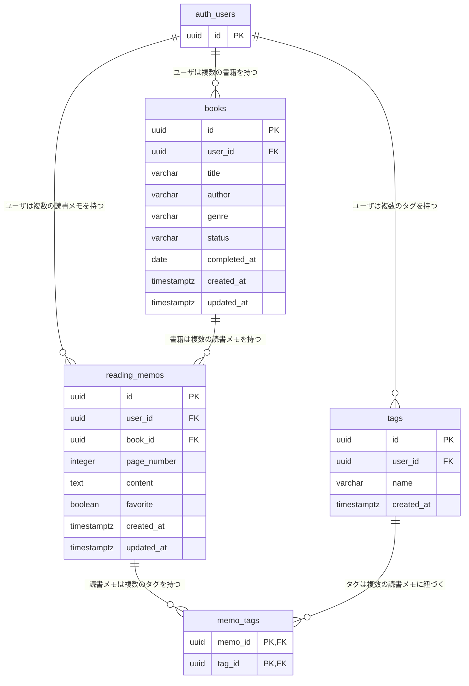

# DB ER図（Mermaid）

## 参照元

設計書: [§4 DB設計](../../design/database/database-design.md)

## 遷移図

```mermaid
erDiagram

    auth_users ||--o{ books : "ユーザは複数の書籍を持つ"
    auth_users ||--o{ reading_memos : "ユーザは複数の読書メモを持つ"
    auth_users ||--o{ tags : "ユーザは複数のタグを持つ"

    books ||--o{ reading_memos : "書籍は複数の読書メモを持つ"

    reading_memos ||--o{ memo_tags : "読書メモは複数のタグを持つ"
    tags ||--o{ memo_tags : "タグは複数の読書メモに紐づく"

    auth_users {
        uuid id PK
    }

    books {
        uuid id PK
        uuid user_id FK
        varchar title
        varchar author
        varchar genre
        varchar status
        date completed_at
        timestamptz created_at
        timestamptz updated_at
    }

    reading_memos {
        uuid id PK
        uuid user_id FK
        uuid book_id FK
        integer page_number
        text content
        boolean favorite
        timestamptz created_at
        timestamptz updated_at
    }

    tags {
        uuid id PK
        uuid user_id FK
        varchar name
        timestamptz created_at
    }

    memo_tags {
        uuid memo_id PK, FK
        uuid tag_id PK, FK
    }
```
