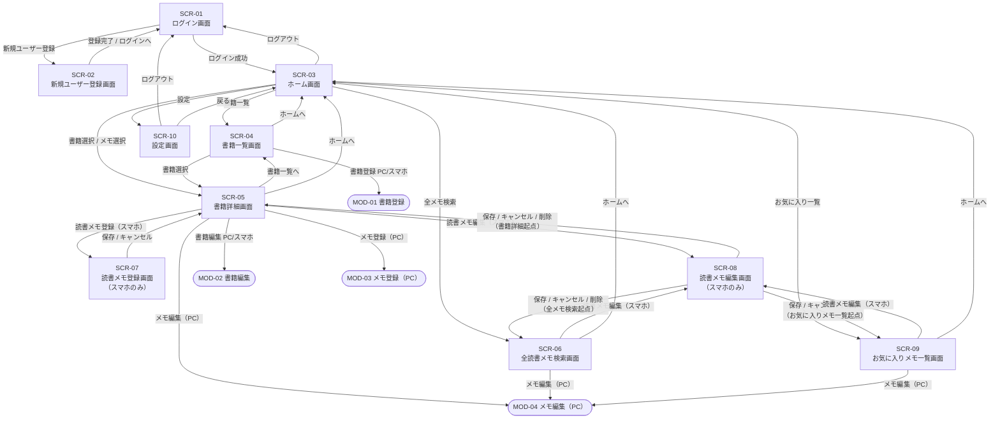

# 9. 画面遷移図

## 参照元

- 要件定義書: [§9 画面遷移図](../../requirements.md)
- 画面設計書: [§3.5 画面遷移図](../../design/screens/screen-design.md)

## 遷移図

```mermaid
flowchart TD

    %% =========================
    %% 認証系
    %% =========================
    SCR01["SCR-01<br/>ログイン画面"]
    SCR02["SCR-02<br/>新規ユーザー登録画面"]

    SCR01 -->|新規ユーザー登録| SCR02
    SCR02 -->|登録完了 / ログインへ| SCR01
    SCR01 -->|ログイン成功| SCR03

    %% =========================
    %% メイン画面
    %% =========================
    SCR03["SCR-03<br/>ホーム画面"]
    SCR04["SCR-04<br/>書籍一覧画面"]
    SCR05["SCR-05<br/>書籍詳細画面"]
    SCR06["SCR-06<br/>全読書メモ検索画面"]
    SCR07["SCR-07<br/>読書メモ登録画面<br/>（スマホのみ）"]
    SCR08["SCR-08<br/>読書メモ編集画面<br/>（スマホのみ）"]
    SCR09["SCR-09<br/>お気に入りメモ一覧画面"]
    SCR10["SCR-10<br/>設定画面"]

    %% =========================
    %% モーダル
    %% =========================
    MOD01(["MOD-01 書籍登録"])
    MOD02(["MOD-02 書籍編集"])
    MOD03(["MOD-03 メモ登録（PC）"])
    MOD04(["MOD-04 メモ編集（PC）"])

    %% =========================
    %% ホーム画面遷移
    %% =========================
    SCR03 -->|書籍一覧| SCR04
    SCR03 -->|書籍選択 / メモ選択| SCR05
    SCR03 -->|全メモ検索| SCR06
    SCR03 -->|お気に入り一覧| SCR09
    SCR03 -->|設定| SCR10
    SCR03 -->|ログアウト| SCR01

    %% =========================
    %% 書籍一覧
    %% =========================
    SCR04 -->|書籍選択| SCR05
    SCR04 -->|ホームへ| SCR03
    SCR04 -->|書籍登録 PC/スマホ| MOD01

    %% =========================
    %% 書籍詳細
    %% =========================
    SCR05 -->|読書メモ登録（スマホ）| SCR07
    SCR05 -->|読書メモ編集（スマホ）| SCR08
    SCR05 -->|書籍一覧へ| SCR04
    SCR05 -->|ホームへ| SCR03
    SCR05 -->|書籍編集 PC/スマホ| MOD02
    SCR05 -->|メモ登録（PC）| MOD03
    SCR05 -->|メモ編集（PC）| MOD04

    %% =========================
    %% 全読書メモ検索
    %% =========================
    SCR06 -->|読書メモ編集（スマホ）| SCR08
    SCR06 -->|ホームへ| SCR03
    SCR06 -->|メモ編集（PC）| MOD04

    %% =========================
    %% 読書メモ登録（スマホ）
    %% =========================
    SCR07 -->|保存 / キャンセル| SCR05

    %% =========================
    %% 読書メモ編集（スマホ）
    %% =========================
    SCR08 -->|保存 / キャンセル / 削除（書籍詳細起点）| SCR05
    SCR08 -->|保存 / キャンセル / 削除（全メモ検索起点）| SCR06
    SCR08 -->|保存 / キャンセル / 削除（お気に入りメモ一覧起点）| SCR09

    %% =========================
    %% お気に入りメモ一覧
    %% =========================
    SCR09 -->|読書メモ編集（スマホ）| SCR08
    SCR09 -->|ホームへ| SCR03
    SCR09 -->|メモ編集（PC）| MOD04

    %% =========================
    %% 設定
    %% =========================
    SCR10 -->|ログアウト| SCR01
    SCR10 -->|戻る| SCR03
```
