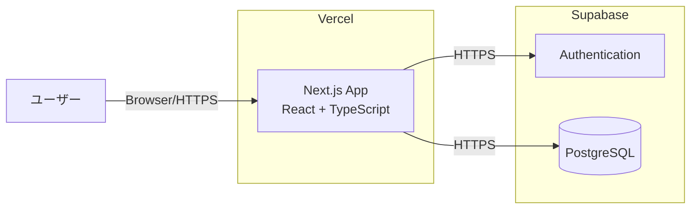

# システム構成図（Mermaid）

## 参照元

設計書: [§1 システム構成設計](../../design/architecture/system-architecture.md)

## 遷移図

```mermaid
flowchart LR

    User[ユーザー]

    subgraph Vercel
        Front[Next.js App\nReact + TypeScript]
    end

    subgraph Supabase
        Auth[Authentication]
        DB[(PostgreSQL)]
    end

    User -->|Browser/HTTPS| Front

    Front -->|HTTPS| Auth
    Front -->|HTTPS| DB

```