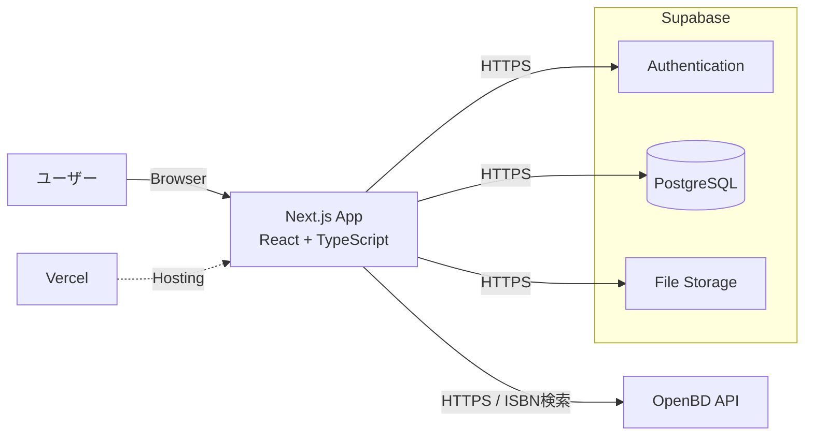

# システム構成図（Mermaid）

設計書: [§1 システム構成設計](../../design/architecture/overview.md)

```mermaid
flowchart LR

    User[ユーザー]

    Front[Next.js App\nReact + TypeScript]
    Vercel[Vercel]

    OpenBD[OpenBD API]

    subgraph Supabase
        Auth[Authentication]
        DB[(PostgreSQL)]
        Storage[File Storage]
    end

    User -->|Browser| Front

    Front -->|HTTPS| Auth
    Front -->|HTTPS| DB
    Front -->|HTTPS| Storage

    Front -->|HTTPS / ISBN検索| OpenBD

    Vercel -. Hosting .-> Front
```