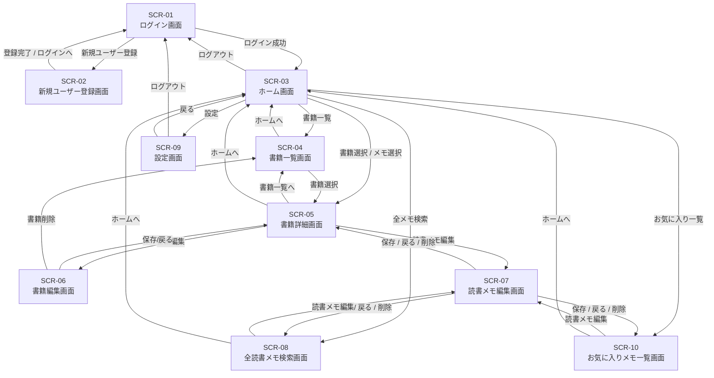

# 読書記録管理アプリ 要件定義書

## 1. システム概要

読書中に素早くメモを記録し、
後から素早く検索・振り返りできる、
読書記録・メモ管理アプリ。

スマートフォン・PCでの利用を前提とし、
「読書中にすぐ記録できること」と
「必要なメモをすぐに見返せること」を重視する。

ユーザーは、自分の読書内容・感想・引用を記録でき、
登録した情報は本人のみが閲覧できる。

読書内容・感想・引用を蓄積することで、
知識の定着と継続的な読書習慣を支援する。

---

## 2. 開発背景

読書中や読書後に感じたことを、
その場ですぐにメモとして残したいと考えていた。

しかし既存の読書管理サービスには、
SNS機能やコミュニティ機能を持つものも多く、
通知や他ユーザーの投稿によって、
読書や記録への集中が妨げられると感じていた。

また、メモ入力までの操作数が多いことや、
過去の記録を素早く検索できないことにも課題を感じていた。

そのため本アプリでは、
SNS機能をあえて排除し、
「素早く記録すること」と
「必要な情報をすぐに探せること」に特化した、
シンプルな読書記録アプリを開発する。

---

## 3. ターゲットユーザー

- 読書中に気になった内容を素早くメモしたい人
- 読んだ本の知見や引用を蓄積・検索したい人
- 思い出したときに過去の読書メモをすぐ見返したい人
- 読了した本、現在読んでいる本を管理したい人
- SNS機能を必要とせず、個人用として読書記録を管理したい人

---

## 4. システム構成

### 開発環境
- Cursor

### フロントエンド
- Next.js (App Router)
- React
- TypeScript
- Tailwind CSS

### バックエンド / BaaS
- Supabase
  - Authentication
  - PostgreSQL Database
  - Storage

### インフラ
- Vercel

---

## 5. 機能要件

### 5.1 機能一覧表
| ID   | 機能名    | 内容            |
| ---- | ------ | ------------- |
| F-01 | ユーザー登録 | メールアドレス又はGoogleアカウントで登録    |
| F-02 | ログイン   | メールアドレス又はGoogleアカウントで認証          |
| F-03 | 書籍登録   | タイトル・著者・ジャンルを登録 |
| F-04 | 書籍編集   | タイトル・著者・ジャンルを編集 |
| F-05 | 書籍削除   | 書籍情報を削除 |
| F-06 | 書籍詳細   | タイトル・著者・ジャンル・登録日・読了日・メモ一覧を表示 |
| F-07 | 書籍一覧表示   | 登録書籍一覧         |
| F-08 | 読書メモ登録 | 引用・感想を記録      |
| F-09 | 読書メモ編集 | 引用・感想を編集      |
| F-10 | 読書メモ削除 | 引用・感想を削除      |
| F-11 | 書籍別読書メモ一覧 | 登録読書メモ一覧 |
| F-12 | 書籍検索     | 書籍タイトル検索     |
| F-13 | 書籍別メモ検索     | 書籍別の読書メモ検索        |
| F-14 | 全読書メモ一覧・検索     | 全書籍の全メモを検索・一覧表示 |
| F-15 | タグ付け   | 読書メモへタグを設定可能。         |
| F-16 | お気に入りメモ一覧 | お気に入りメモ一覧 |
| F-17 | ホーム画面 | 最近読んだ本・最近のメモ・お気に入りメモ・読書中書籍を表示 |

---

### 5.2 機能概要

### F-01 ユーザー登録

**概要**
- メールアドレス・パスワードによるアカウント登録。
- Googleアカウントによる登録。

---

### F-02 ログイン

**概要**
- メールアドレス・パスワードによるログイン。
- Googleアカウントによるログイン。

---

### F-03 書籍登録

**概要**
書籍情報を登録する。

**入力項目**
- タイトル
- 著者
- ジャンル
- 読書ステータス（未読、読書中、読了）
- 登録日（自動入力）
- 読了日

---

### F-04 書籍編集

**概要**
- タイトル・著者・ジャンル・読書ステータス・読了日を修正可能とする。
- 読了日は初期表示で今日の日付が自動入力される。

---

### F-06 書籍詳細

**概要**
タイトル・著者・ジャンル・読書ステータス・登録日・読了日・メモ一覧を表示する。

---

### F-07 書籍一覧表示

**概要**
- ログインユーザーが登録した書籍を表形式で一覧で表示する。
- 読了している書籍には「読了」と表示する。
- 書籍毎にメモ数、お気に入りメモ数を表示

---

### F-08 読書メモ登録

**概要**
書籍に紐づく読書メモを登録する。

**入力項目**
- 該当ページ数
- メモ内容
- 登録日（自動入力）
- タグ（複数設定可能）

---

### F-11 書籍別読書メモ一覧

**概要**
- 対象書籍に紐づく読書メモを表形式で一覧表示。
- スマートフォンで利用の場合、読書メモをカード形式で一覧表示。
- メモごとの「お気に入り（★）」登録機能。
- 読書メモの登録日の降順で表示する。

---

### F-12 書籍検索

**概要**
書籍一覧画面にて、タイトル・著者でキーワード検索が可能。

---

### F-13 書籍別メモ検索

**概要**
書籍詳細画面（メモ一覧画面）でメモ内容・タグによるキーワード検索が可能。

---

### F-14 全読書メモ一覧・検索

**概要**
- ログインユーザーが登録した全書籍の読書メモを一覧表示する。
- メモ内容・タグによるキーワード検索が可能。
- 書籍名、メモ内容、登録日、タグを表示する。
- メモごとの「お気に入り（★）」登録機能。
- 読書メモの登録日の降順で表示する。

---

### F-15 タグ付け

**概要**
- 読書メモへ複数タグを設定可能。
- タグの追加・削除が可能。
- タグはユーザーが自由入力可能。

---

### F-16 お気に入りメモ一覧

**概要**
- ログインユーザーがお気に入り登録した読書メモを一覧表示する。
- 書籍名・著者名・タグによるフィルタでの絞り込み可能。
- 書籍名・著者名・メモ内容・タグによるキーワード検索が可能。
- お気に入り登録の解除が可能。
- 読書メモの登録日の降順で表示する。

### F-17 ホーム画面

**概要**
- ログイン後の初期表示画面とする。
- 最近読んだ本を表示する。
- 最近登録した読書メモを表示する。
- お気に入りメモを表示する。
- 読書中書籍を表示する。

## 6. 非機能要件

### 6.1 性能要件
- 主要画面は2秒以内の表示を目指す。
- メモ保存は1秒以内に完了することを目指す。
- メモ検索は1秒以内に結果を表示する。
- 入力操作を妨げないレスポンスを実現する。

---

### 6.2 セキュリティ要件
- Supabase Authentication による認証を行う。
- HTTPS通信を利用する。
- RLSにより他ユーザのデータを参照不可とする。

---

### 6.3 可用性要件
- Vercel / Supabase のマネージドサービスを利用する。
- 障害発生時はサービス復旧まで待機する。

---

### 6.4 保守性要件
- TypeScript による型安全性を確保する。
- ESLint / Prettier を利用する。
- GitHub によるバージョン管理を行う。

---

### 6.5 対応環境
- PC / スマートフォンブラウザに対応する。
- Chrome / Edge 最新版を対象とする。
- Android Chrome における PWA 動作をサポート対象とする。

---

### 6.6 PWA要件
- PWA（Progressive Web App）に対応する。
- ホーム画面への追加を可能とする。
- standalone モードでネイティブアプリ風に起動できるようにする。
- manifest.json を定義する。
- Service Worker を利用する。
- アプリアイコンを設定する。
- HTTPS環境で動作させる。

#### PWA対象機能
- ホーム画面追加
- オフライン時のキャッシュ利用
- 高速起動
- ブラウザUI非表示での起動

---

### 6.7 オフラインキャッシュ方針
- Service Worker により静的アセットをキャッシュする。
- キャッシュ対象：
  - HTML
  - CSS
  - JavaScript
  - 一部APIレスポンス

- オフライン時はキャッシュ済み画面を表示する。
- オフライン時の新規データ登録・同期は対象外とする。
- キャッシュ戦略は段階的に拡張可能とする。

---

## 7. 画面一覧

| 画面ID | 画面名 | 概要 |
| --- | --- | --- |
| SCR-01 | ログイン画面 | ユーザー認証を行う画面 |
| SCR-02 | 新規ユーザー登録画面 | 新規ユーザー情報を登録する画面 |
| SCR-03 | ホーム画面 | ログイン後に表示され、最近読んだ本・最近のメモ・お気に入りメモ・読書中書籍を表示する画面 |
| SCR-04 | 書籍一覧画面 | 登録済み書籍の一覧表示、書籍検索、書籍登録導線を提供する画面 |
| SCR-05 | 書籍詳細画面 | 書籍情報表示、読書メモ一覧、読書メモ検索、読書メモ登録・編集・削除、お気に入り操作を行う画面 |
| SCR-06 | 書籍編集画面 | 書籍情報の編集・削除を行う画面 |
| SCR-07 | 読書メモ編集画面 | 読書メモの編集・削除・お気に入り設定を行う画面 |
| SCR-08 | 全読書メモ検索画面 | 登録済み読書メモを横断検索する画面 |
| SCR-09 | 設定画面 | ユーザー設定やログアウトを行う画面 |
| SCR-10 | お気に入りメモ一覧画面 | お気に入り登録した読書メモを一覧表示する画面 |

---

## 7.1 各画面の主な機能

### SCR-01 ログイン画面
- メールアドレス入力
- パスワード入力
- ログイン
- 新規ユーザー登録画面遷移

### SCR-02 新規ユーザー登録画面
- ユーザー名入力
- メールアドレス入力
- パスワード入力
- ユーザー登録
- ログイン画面遷移

### SCR-03 ホーム画面
- 最近読んだ書籍表示
- 最近登録した読書メモ表示
- お気に入り読書メモ表示
- 読書中書籍表示
- 書籍詳細画面遷移
- 書籍一覧画面遷移
- 全読書メモ検索画面遷移
- お気に入りメモ一覧画面遷移
- 設定画面遷移
- ログアウト

### SCR-04 書籍一覧画面
- 登録済み書籍一覧表示
- 書籍検索
- 書籍登録
- 書籍詳細画面遷移

### SCR-05 書籍詳細画面
- 書籍情報表示
- 読書メモ一覧表示
- 読書メモ登録
- 読書メモタグ設定
- 読書メモ検索
- 読書メモお気に入り設定
- 読書メモ編集
- 読書メモ削除

### SCR-06 書籍編集画面
- 書籍情報編集
- 書籍削除

### SCR-07 読書メモ編集画面
- 読書メモ編集
- 読書メモ削除
- お気に入り設定

### SCR-08 全読書メモ検索画面
- 全読書メモ検索
- 書籍名・著者名・タグによるフィルタ絞り込み
- 書籍名・著者名・メモ内容・タグによるキーワード検索
- お気に入り絞り込み
- お気に入り解除
- 読書メモ編集画面遷移

### SCR-09 設定画面
- ログアウト
- アカウント削除
- ユーザー設定変更（表示名・メールアドレス・パスワード変更等）

### SCR-10 お気に入りメモ一覧画面
- お気に入り読書メモ一覧表示
- 読書メモ検索
- お気に入り解除
- 読書メモ編集画面遷移
- ホーム画面遷移

## 8. 画面遷移図

